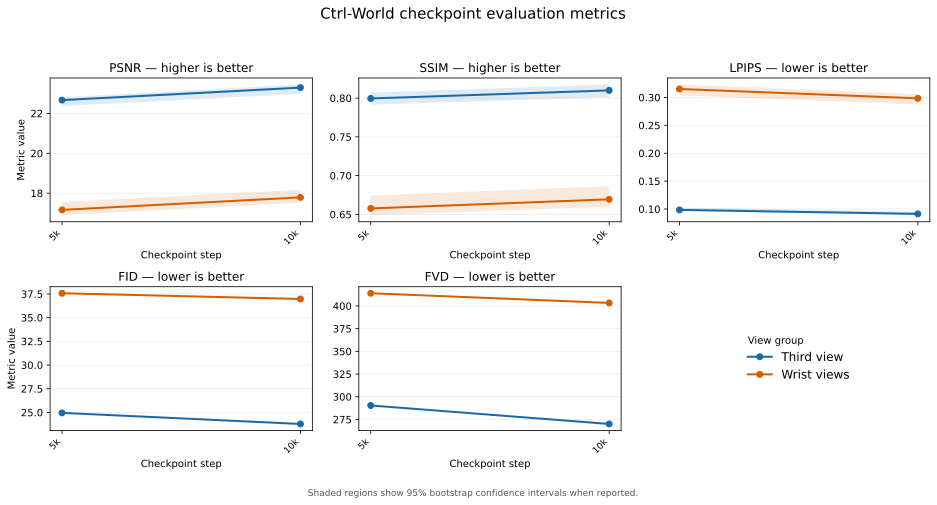
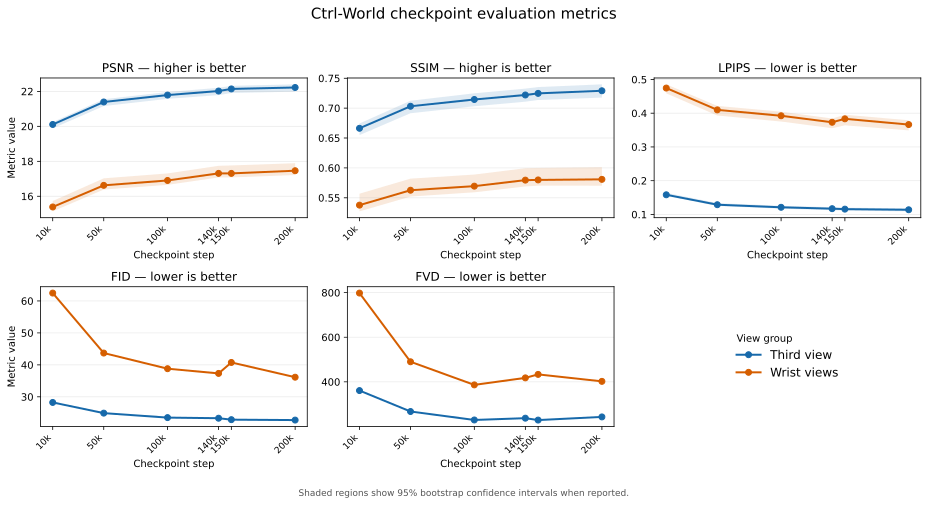

# Experiments

One entry per evaluated run. Numbers here are copied from the JSON in
`experiments/<tag>/eval/`, so the record cannot drift from the prose. A job writes its
metrics to `outputs/<tag>/eval/` on the cluster, which is gitignored along with the rest
of `outputs/`; copy the JSON into `experiments/<tag>/eval/` to keep it. Protocol,
deviations from the paper, and the reasoning behind each metric live in
[evaluation.md](evaluation.md); this file is the results log.

## 0002_abc_rigid — SVD world model on ABC-130k (`abc_rigid`)

Branch `abc-130k`. 4x A100 x batch 4 x grad-accum 4 = effective batch 64, matching the
paper's 2x8 H100. Trained from SVD init; checkpoints every 2500 steps.

Evaluated at **step 5000** and **step 10000** on `eval_clips_v1`: 226 clips over 121
episodes of the validation split, 12 autoregressive rounds each. Each round predicts 5
frames and the next round overlaps by one, so a clip is 49 frames (9.8 s at 5 Hz) and
48 are scored — every round's frame 0 is dropped because it is the conditioning frame,
not a prediction. Free-running: after the first round the model conditions only on its
own output. Ground truth is the raw mp4 frames at the 5 Hz latent rate, with no VAE
round-trip, so the reported error includes the autoencoder's own reconstruction loss.



The graph plots the five evaluation metrics for the third-view and wrist-view groups.
Shaded regions show 95% bootstrap confidence intervals when the metric record includes
them. To update the graph after adding metric records, run:

```bash
python3 experiments/plot_checkpoint_metrics.py \
    --inputs experiments/0002_abc_rigid/eval/metrics_step*.json \
    --out experiments/0002_abc_rigid/checkpoint_metrics.svg
```

Views are scored in two groups. `third_view` is the single `top` camera; `wrist_view`
pools `left_wrist` and `right_wrist`. All three are denoised jointly as one latent
stacked vertically, then split per camera before the VAE decode.

### Pixel metrics

Brackets are 95% bootstrap CIs resampled over **episodes**, not clips, since clips from
the same episode are not independent.

**third_view (`top`)**

| | step 5000 | step 10000 |
|---|---|---|
| PSNR (dB) | 22.667 [22.367, 22.809] | **23.293** [22.987, 23.448] |
| SSIM | 0.7996 [0.7915, 0.8071] | **0.8100** [0.8013, 0.8175] |
| LPIPS | 0.0984 [0.0961, 0.1025] | **0.0913** [0.0889, 0.0952] |
| vs copy-frame | −1.692 dB | **−1.065 dB** |

**wrist_view (`left_wrist` + `right_wrist`)**

| | step 5000 | step 10000 |
|---|---|---|
| PSNR (dB) | 17.167 [16.898, 17.562] | **17.793** [17.522, 18.173] |
| SSIM | 0.6577 [0.6489, 0.6744] | **0.6694** [0.6601, 0.6865] |
| LPIPS | 0.3151 [0.3037, 0.3232] | **0.2984** [0.2873, 0.3059] |
| vs copy-frame | −2.004 dB | **−1.379 dB** |

+0.63 dB on both groups with disjoint PSNR CIs, so the improvement from 5k to 10k is
real and the model is still far from converged — the paper trains for 100k steps.

The copy-frame baseline (`psnr_static_round`, 24.358 dB third-view / 19.172 wrist) is
identical at both steps by construction: it repeats each round's conditioning frame, so
it does not depend on the checkpoint. It is still ahead of the model, but the gap
halved in 5000 steps. **It is an oracle**: it is handed the real frame at every round
start, while the model is free-running on its own drifted prediction. Read `gain_db` as
"how far behind an oracle that never moves", not as a fair competitor.

### Distribution metrics

| | step 5000 | step 10000 |
|---|---|---|
| FID third_view | 24.950 | 23.783 |
| FVD third_view | 290.375 | 270.030 |
| FID wrist_view | 37.574 | 36.965 |
| FVD wrist_view | 413.982 | 403.324 |

FVD moves −7.0% third-view but only −2.6% wrist, against −7.3% / −5.3% on LPIPS. The
wrist rollouts are landing closer to the right frames without their distribution of
motion looking much more real.

Neither table entry carries a confidence interval: both runs computed the distance once
over the whole pooled feature set. On 226 clips a 10-point FVD move sits within the range
where Fréchet estimators still carry sample-size bias, so read the wrist −10.7 as
directional rather than as a measured change. Published FID and FVD numbers carry no
interval either. The pixel metrics are what settle whether one checkpoint beats another.

FVD uses stylegan-v's I3D (MD5-pinned in `scripts/eval_leonardo.sh`), the de facto
standard, so the absolute scale is comparable to published numbers. **FID is not
portable**: it uses torchvision's ImageNet Inception rather than the TF-ported
`pt_inception` that the literature quotes. Compare it only against runs from this repo.

### Latent MSE by round

Third-view latent error saturates rather than diverging — 0.211 at round 1, 0.301 by
round 4, 0.317 at round 12 (mean 0.296). Per-round PSNR shows the same shape:

| round | 1 | 2 | 3 | 4 | 6 | 8 | 10 | 12 |
|---|---|---|---|---|---|---|---|---|
| step 5000 | 25.37 | 23.59 | 22.92 | 22.65 | 22.32 | 22.20 | 22.02 | 22.03 |
| step 10000 | 25.73 | 24.13 | 23.56 | 23.28 | 22.98 | 22.87 | 22.73 | 22.73 |

Most of the degradation happens in the first three rounds and then flattens, so the
rollout is not accumulating unbounded drift over 9.8 s.

### Exact configuration

```json
{"history_idx": [0, 0, -8, -6, -4, -2], "num_inference_steps": 50, "guidance_scale": 1.0,
 "pred_step": 5, "interact_num": 12, "num_history": 6, "num_frames": 5, "seed": 0}
```

`history_idx` matches `rollout_replay_traj.py`, not `config.py` — see the history-index
section of [evaluation.md](evaluation.md) for why.

### Reproducing

All of this runs on Leonardo. Compute nodes have no internet, so the two `setup` steps
must run on a login node first.

```bash
# once: deps, LPIPS AlexNet, FID Inception, and the MD5-pinned I3D
scripts/eval_leonardo.sh setup

# once: draw the fixed clip list (already committed as eval_clips_v1.json —
# only rerun to make a new version, and bump the filename if you do)
scripts/eval_leonardo.sh clips

# per checkpoint, inside a GPU job
cluster submit leonardo --gpus 1 --cpus 8 --time 04:00:00 --name eval_leonardo \
  -- scripts/eval_leonardo.sh run 10000
```

One checkpoint takes ~2.5 h on a single A100 at `BATCH_SIZE=4` (step 10000 ran 2:33:12,
step 5000 ran 2:39:11). Override `CKPT`, `OUT`, or `BATCH_SIZE` in the environment if
you need a path outside the default `outputs/0002_abc_rigid/model/` layout.

Verify the scoring code without a GPU or the dataset:

```bash
python scripts/selftest_eval_metrics.py   # 18 checks, CPU only
```

### Known gaps

- **Not converged.** A run to 30000 steps started on 2026-08-21 as job 53334785, resumed
  from `checkpoint-10000.pt`. 20000 steps at 4.5 s/it takes about 25 hours, which exceeds
  the 24-hour wall of the default quality of service (QoS), so the job runs under
  `boost_qos_lprod` and its 36-hour limit as a single job instead of two chained ones:
  `MAX_STEPS=30000 RESUME=--resume sbatch jobs/train.sbatch`. Without `--ckpt_path`,
  `--resume` selects the highest-numbered `checkpoint-<step>.pt`.
- **Pixel metrics score appearance, not control accuracy.** PSNR and SSIM reward a
  blurred mean-future, and nothing currently measures whether the predicted motion is
  the commanded one. Mask-based region metrics were tried and abandoned; see
  `plans/object-region-metrics.md`.
- **No fair per-round baseline.** A baseline repeating the model's *own* conditioning
  frame would separate "this round predicted no motion" from "the rollout has drifted",
  which the current oracle baseline confounds.
- **No CIs on FID/FVD**, as the distribution-metrics section explains. Read those two
  columns as directional rather than as evidence on their own.

## 0003_abc_mcap — SVD world model on ABC-130k (`abc_mcap`)

Branch `abc-130k`, trained on the `abc_mcap` re-extraction at 256x192. That resolution is
1.33x the tokens of the 192x192 `abc_rigid` run, so the per-device batch drops to 2 and
`jobs/train_mcap.sbatch` derives the accumulation from the process count, holding the
effective batch at the paper's 64 on any topology. The run targets 200000 steps, twice the
paper's budget. No wall clock covers that, so each job chains a successor that resumes
from the newest checkpoint and exits once the target is reached.

Training costs 6.94 s per step on one node of 4 A100s, measured over the eight jobs that
carried the run from step 120000 to 200000. Reaching 200000 steps is therefore about
386 hours, or 16 days, of uninterrupted compute. The chain spent 182 hours on that last
80000 steps against an ideal of 154, because each job is killed at the 24-hour wall and
its successor restarts from the last checkpoint: 15% of the steps were computed twice.
Lowering `checkpointing_steps` shrinks that overhead, since the work lost per link is
bounded by the checkpoint interval.

Six checkpoints are scored on `eval_clips_v1` for `abc_mcap`: 256 clips over 182 episodes
of the validation split, 12 autoregressive rounds each, free-running after the first
round. Every metric below is computed, none skipped.



The graph plots the five metrics for the third-view and wrist-view groups, with 95%
bootstrap confidence intervals shaded. To update it after adding a metric record, run:

```bash
python3 experiments/plot_checkpoint_metrics.py \
    --inputs experiments/0003_abc_mcap/eval/metrics_step*.json \
    --out experiments/0003_abc_mcap/checkpoint_metrics.svg
```

### Author history, not the evaluation default

These runs pin `history_idx = [0, 0, -12, -9, -6, -3]`, the value `config.py` ships and the
policy-in-the-loop scripts read. It is not what `eval_video_metrics.py` uses by default:
that is `[-6, -5, -4, -3, -2, -1]`, the evenly spaced `skip=1` history that pairs with the
consecutive frames a rollout predicts, for the reasons in the history-index section of
[evaluation.md](evaluation.md). Pass `HIST` to `jobs/eval_mcap.sbatch` to select the
author history; the file name records which one produced a result.

Step 140000 was scored both ways, so the two histories can be compared directly:

| | default `[-6,…,-1]` | author `[0,0,-12,-9,-6,-3]` |
|---|---|---|
| PSNR third_view | 22.059 | 22.020 |
| PSNR wrist_view | 17.327 | 17.311 |
| LPIPS third_view | 0.1199 | 0.1171 |
| LPIPS wrist_view | 0.3778 | 0.3731 |
| FID / FVD third_view | 24.336 / 231.44 | 23.311 / 237.04 |
| FID / FVD wrist_view | 41.250 / 440.86 | 37.328 / 417.79 |

The two agree on PSNR to within 0.04 dB and disagree on the distribution metrics, where
the author history is 4 FID points better on the wrist views. Read the tables that follow
as the author-history series; they are not comparable to the `0002_abc_rigid` numbers,
which use a third pattern, `[0, 0, -8, -6, -4, -2]`.

### Pixel metrics

Brackets are 95% bootstrap confidence intervals (CIs) resampled over episodes, not clips,
since clips from the same episode are not independent.

**third_view (`top`)**

| | 10000 | 50000 | 100000 | 140000 | 150000 | 200000 |
|---|---|---|---|---|---|---|
| PSNR (dB) | 20.108 [19.885, 20.245] | 21.394 [21.162, 21.552] | 21.789 [21.574, 21.965] | 22.020 [21.789, 22.207] | 22.141 [21.911, 22.317] | **22.222** [21.983, 22.404] |
| SSIM | 0.6663 [0.6549, 0.6743] | 0.7031 [0.6915, 0.7124] | 0.7145 [0.7031, 0.7249] | 0.7220 [0.7108, 0.7327] | 0.7247 [0.7136, 0.7353] | **0.7291** [0.7177, 0.7398] |
| LPIPS | 0.1583 [0.1549, 0.1640] | 0.1289 [0.1251, 0.1336] | 0.1212 [0.1170, 0.1256] | 0.1171 [0.1126, 0.1214] | 0.1157 [0.1115, 0.1200] | **0.1139** [0.1092, 0.1182] |
| vs copy-frame | −1.615 | −0.329 | +0.066 | +0.296 | +0.417 | **+0.499** |

**wrist_view (`left_wrist` + `right_wrist`)**

| | 10000 | 50000 | 100000 | 140000 | 150000 | 200000 |
|---|---|---|---|---|---|---|
| PSNR (dB) | 15.390 [15.139, 15.731] | 16.626 [16.387, 17.027] | 16.905 [16.656, 17.309] | 17.311 [17.077, 17.744] | 17.309 [17.079, 17.764] | **17.463** [17.217, 17.892] |
| SSIM | 0.5377 [0.5273, 0.5568] | 0.5627 [0.5520, 0.5821] | 0.5695 [0.5592, 0.5889] | 0.5795 [0.5690, 0.5995] | 0.5799 [0.5702, 0.6000] | **0.5808** [0.5702, 0.6013] |
| LPIPS | 0.4745 [0.4588, 0.4856] | 0.4098 [0.3931, 0.4216] | 0.3924 [0.3753, 0.4045] | **0.3731** [0.3555, 0.3842] | 0.3833 [0.3640, 0.3955] | 0.3664 [0.3491, 0.3791] |
| vs copy-frame | −2.501 | −1.265 | −0.986 | −0.580 | −0.582 | **−0.428** |

Three findings sit in these tables.

The first is that the third view passes the copy-frame oracle. `psnr_static_round` repeats
each round's real conditioning frame and is therefore handed ground truth 12 times per
clip while the model free-runs on its own prediction; `0002_abc_rigid` trailed it by more
than a decibel. Here the third view starts 1.62 dB behind at step 10000, crosses at
100000, and reaches +0.50 dB by 200000. The wrist views still trail it, by 0.43 dB, and
the left wrist is the worse of the two: −0.81 dB against −0.04 for the right at step
200000.

The second is that returns fall off sharply after 100000 steps. The third view gains
1.68 dB over the first 100000 steps and 0.43 dB over the second, and the wrist gains
1.52 dB then 0.56 dB. Between 140000 and 200000 every metric improves by less than the
width of its own CI — the wrist PSNR intervals, [17.077, 17.744] and [17.217, 17.892],
overlap almost entirely — whereas the 10000 and 200000 intervals are disjoint on both
groups by a wide margin. The gain over the last third of training is real in direction
and negligible in size, which matches the flat training loss over the same span.

The third is that step 150000 is not on the trend for the wrist views. Its wrist PSNR ties
140000 to within 0.002 dB while its wrist LPIPS, FID, and FVD are all worse, and the
200000 checkpoint then recovers on all three. The third view shows nothing comparable and
improves monotonically across all six checkpoints. Read this as checkpoint-to-checkpoint
variation in the wrist views rather than as a stage of training, and treat any single
wrist number as carrying that much scatter.

### Distribution metrics

| | 10000 | 50000 | 100000 | 140000 | 150000 | 200000 |
|---|---|---|---|---|---|---|
| FID third_view | 28.243 | 24.900 | 23.500 | 23.311 | 22.856 | 22.728 |
| FVD third_view | 360.81 | 266.91 | 229.01 | 237.04 | 228.52 | 242.72 |
| FID wrist_view | 62.462 | 43.696 | 38.800 | 37.328 | 40.754 | 36.141 |
| FVD wrist_view | 798.07 | 489.93 | 386.33 | 417.79 | 433.36 | 402.14 |

Third-view FID falls monotonically. Nothing else does. Third-view FVD reaches its best
value at step 150000 and is 14 points worse at 200000; wrist FID and FVD both jump at
150000 and recover at 200000. Neither metric carries a confidence interval, both are
computed once over the pooled feature set, and on 256 clips a Fréchet estimator still
carries sample-size bias at this magnitude. A 14-point third-view FVD move is not evidence
that the rollouts became less realistic while every pixel metric and FID improved. Treat
FVD here as directional at best, and read it over the whole series — 798 to 402 on the
wrist views — rather than between adjacent checkpoints.

As in `0002_abc_rigid`, FVD uses stylegan-v's I3D, so its absolute scale is comparable to
published numbers, and **FID is not portable**: it uses torchvision's ImageNet Inception
rather than the TF-ported `pt_inception` the literature quotes. Compare FID only against
runs from this repo.

### Drift across rounds

Per-round third-view PSNR, in decibels:

| round | 1 | 2 | 3 | 4 | 6 | 8 | 10 | 12 | 1 to 12 |
|---|---|---|---|---|---|---|---|---|---|
| 10000 | 22.74 | 21.13 | 20.46 | 20.15 | 19.81 | 19.59 | 19.48 | 19.38 | −3.36 |
| 50000 | 23.51 | 22.25 | 21.69 | 21.45 | 21.14 | 20.97 | 20.88 | 20.77 | −2.74 |
| 100000 | 23.74 | 22.54 | 22.02 | 21.85 | 21.59 | 21.40 | 21.31 | 21.20 | −2.53 |
| 140000 | 23.92 | 22.82 | 22.30 | 22.09 | 21.79 | 21.61 | 21.52 | 21.46 | −2.46 |
| 150000 | 23.96 | 22.90 | 22.50 | 22.24 | 21.95 | 21.76 | 21.64 | 21.54 | −2.42 |
| 200000 | 24.04 | 23.02 | 22.53 | 22.32 | 22.05 | 21.84 | 21.69 | 21.61 | −2.43 |

The shape is the same at every step: most of the loss lands in the first three rounds and
then flattens. Training flattens that curve early and then stops. The round 1
to round 12 drop shrinks from 3.36 dB to 2.53 dB over the first 100000 steps, then moves
0.10 dB over the next 100000 while the whole curve shifts up by about 0.4 dB. The wrist
views never flatten at all — the left wrist drops 4.69 dB at step 10000 and 4.65 dB at
200000 — so their improvement in `psnr_static_round_gain_db` is entirely that level shift,
not a slower accumulation of error.

Mean latent mean squared error (MSE) follows training with the same 150000 exception:
0.4873 at 10000, 0.4218 at 50000, 0.4117 at 100000, 0.3905 at 140000, 0.3911 at 150000,
and 0.3852 at 200000. Within a rollout it saturates rather than diverging, reaching 0.260
at round 1 and 0.423 at round 12 for step 200000.

### Qualitative review

Watching the step 100000 videos finds inconsistencies the aggregate metrics do not
describe. The wrist cameras show the most visible failures, including unstable appearance
and motion across successive frames. The three views also do not stay aligned: the same
scene or action can evolve differently in the top and the wrist views. Reporting temporal
consistency within each camera and cross-view consistency across the three cameras would
close that gap, with particular attention to the wrist views.

Set `DUMP_FRAMES=1` to write every clip's ground truth and prediction losslessly for this
kind of review. The dump is gigabytes — 7.0 GB for the 256 clips at step 200000 — so it
stays in the durable tree beside the metrics rather than in the run directory that
`cluster fetch` copies back whole.

### Exact configuration

```json
{"history_idx": [0, 0, -12, -9, -6, -3], "num_inference_steps": 50, "guidance_scale": 1.0,
 "pred_step": 5, "interact_num": 12, "num_history": 6, "num_frames": 5, "seed": 0}
```

### Reproducing

Score one checkpoint under the author history, from a checkout with the Leonardo
environment prepared as the reproducing section of `0002_abc_rigid` describes:

```bash
cluster submit leonardo --gpus 1 --cpus 8 --time 08:00:00 \
  -n abc-mcap-eval-200k-authorhist \
  -m "score the final checkpoint under author history" \
  -- bash -c 'STEP=200000 HIST="0,0,-12,-9,-6,-3" HIST_NAME=0_0_m12_m9_m6_m3 \
       bash jobs/eval_mcap.sbatch'
```

One checkpoint takes about 4 hours on a single A100 at `BATCH_SIZE=4` with the frame dump
on; step 200000 ran 3:53. Drop `DUMP_FRAMES` to skip the dump. The job writes its metrics
to `outputs/0003_abc_mcap/eval/` in the durable tree and leaves a copy in the run
directory for `cluster fetch`.

### Known gaps

- **The wrist views scatter between checkpoints.** Step 150000 ties 140000 on wrist PSNR
  while losing ground on wrist LPIPS, FID, and FVD, and 200000 recovers. Nothing
  distinguishes the three checkpoints except the scatter itself, so a wrist comparison
  needs more than two points to mean anything.
- **FVD disagrees with every other metric** at several points in the series, and has no
  confidence interval to say whether any of those disagreements are real.
- **Pixel metrics score appearance, not control accuracy.** Nothing here measures whether
  the predicted motion is the commanded one. Mask-based region metrics were tried and
  abandoned; see `plans/object-region-metrics.md`.
- **No fair per-round baseline.** A baseline repeating the model's own conditioning frame
  would separate "this round predicted no motion" from "the rollout has drifted", which
  the copy-frame oracle confounds.
