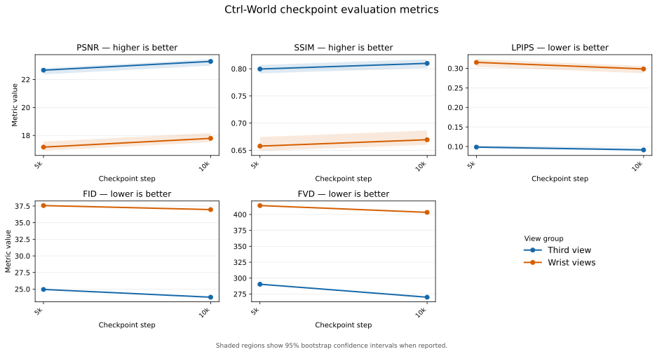
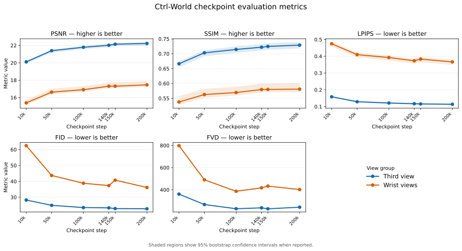

# Experiments

One entry per evaluated run. Numbers here are copied from the JSON in
`experiments/<tag>/eval/`, so the record cannot drift from the prose. A job writes its
metrics to `outputs/<tag>/eval/` on the cluster, which is gitignored along with the rest
of `outputs/`; copy the JSON into `experiments/<tag>/eval/` to keep it. Protocol,
deviations from the paper, and the reasoning behind each metric live in
[evaluation.md](evaluation.md); this file is the results log.

## 0002_abc_rigid — SVD world model on ABC-130k (`abc_rigid`)

Branch `abc-130k`. 4x A100 x batch 4 x grad-accum 4 = effective batch 64, matching the
paper's 2x8 H100. Trained from SVD init; checkpoints every 2500 steps.

Evaluated at **step 5000** and **step 10000** on `eval_clips_v1`: 226 clips over 121
episodes of the validation split, 12 autoregressive rounds each. Each round predicts 5
frames and the next round overlaps by one, so a clip is 49 frames (9.8 s at 5 Hz) and
48 are scored — every round's frame 0 is dropped because it is the conditioning frame,
not a prediction. Free-running: after the first round the model conditions only on its
own output. Ground truth is the raw mp4 frames at the 5 Hz latent rate, with no VAE
round-trip, so the reported error includes the autoencoder's own reconstruction loss.



The graph plots the five evaluation metrics for the third-view and wrist-view groups.
Shaded regions show 95% bootstrap confidence intervals when the metric record includes
them. To update the graph after adding metric records, run:

```bash
python3 experiments/plot_checkpoint_metrics.py \
    --inputs experiments/0002_abc_rigid/eval/metrics_step*.json \
    --out experiments/0002_abc_rigid/checkpoint_metrics.svg
```

Views are scored in two groups. `third_view` is the single `top` camera; `wrist_view`
pools `left_wrist` and `right_wrist`. All three are denoised jointly as one latent
stacked vertically, then split per camera before the VAE decode.

### Pixel metrics

Brackets are 95% bootstrap CIs resampled over **episodes**, not clips, since clips from
the same episode are not independent.

**third_view (`top`)**

| | step 5000 | step 10000 |
|---|---|---|
| PSNR (dB) | 22.667 [22.367, 22.809] | **23.293** [22.987, 23.448] |
| SSIM | 0.7996 [0.7915, 0.8071] | **0.8100** [0.8013, 0.8175] |
| LPIPS | 0.0984 [0.0961, 0.1025] | **0.0913** [0.0889, 0.0952] |
| vs copy-frame | −1.692 dB | **−1.065 dB** |

**wrist_view (`left_wrist` + `right_wrist`)**

| | step 5000 | step 10000 |
|---|---|---|
| PSNR (dB) | 17.167 [16.898, 17.562] | **17.793** [17.522, 18.173] |
| SSIM | 0.6577 [0.6489, 0.6744] | **0.6694** [0.6601, 0.6865] |
| LPIPS | 0.3151 [0.3037, 0.3232] | **0.2984** [0.2873, 0.3059] |
| vs copy-frame | −2.004 dB | **−1.379 dB** |

+0.63 dB on both groups with disjoint PSNR CIs, so the improvement from 5k to 10k is
real and the model is still far from converged — the paper trains for 100k steps.

The copy-frame baseline (`psnr_static_round`, 24.358 dB third-view / 19.172 wrist) is
identical at both steps by construction: it repeats each round's conditioning frame, so
it does not depend on the checkpoint. It is still ahead of the model, but the gap
halved in 5000 steps. **It is an oracle**: it is handed the real frame at every round
start, while the model is free-running on its own drifted prediction. Read `gain_db` as
"how far behind an oracle that never moves", not as a fair competitor.

### Distribution metrics

| | step 5000 | step 10000 |
|---|---|---|
| FID third_view | 24.950 | 23.783 |
| FVD third_view | 290.375 | 270.030 |
| FID wrist_view | 37.574 | 36.965 |
| FVD wrist_view | 413.982 | 403.324 |

FVD moves −7.0% third-view but only −2.6% wrist, against −7.3% / −5.3% on LPIPS. The
wrist rollouts are landing closer to the right frames without their distribution of
motion looking much more real.

Neither table entry carries a confidence interval: both runs computed the distance once
over the whole pooled feature set. On 226 clips a 10-point FVD move sits within the range
where Fréchet estimators still carry sample-size bias, so read the wrist −10.7 as
directional rather than as a measured change. Published FID and FVD numbers carry no
interval either. The pixel metrics are what settle whether one checkpoint beats another.

FVD uses stylegan-v's I3D (MD5-pinned in `scripts/eval_leonardo.sh`), the de facto
standard, so the absolute scale is comparable to published numbers. **FID is not
portable**: it uses torchvision's ImageNet Inception rather than the TF-ported
`pt_inception` that the literature quotes. Compare it only against runs from this repo.

### Latent MSE by round

Third-view latent error saturates rather than diverging — 0.211 at round 1, 0.301 by
round 4, 0.317 at round 12 (mean 0.296). Per-round PSNR shows the same shape:

| round | 1 | 2 | 3 | 4 | 6 | 8 | 10 | 12 |
|---|---|---|---|---|---|---|---|---|
| step 5000 | 25.37 | 23.59 | 22.92 | 22.65 | 22.32 | 22.20 | 22.02 | 22.03 |
| step 10000 | 25.73 | 24.13 | 23.56 | 23.28 | 22.98 | 22.87 | 22.73 | 22.73 |

Most of the degradation happens in the first three rounds and then flattens, so the
rollout is not accumulating unbounded drift over 9.8 s.

### Exact configuration

```json
{"history_idx": [0, 0, -8, -6, -4, -2], "num_inference_steps": 50, "guidance_scale": 1.0,
 "pred_step": 5, "interact_num": 12, "num_history": 6, "num_frames": 5, "seed": 0}
```

`history_idx` matches `rollout_replay_traj.py`, not `config.py` — see the history-index
section of [evaluation.md](evaluation.md) for why.

### Reproducing

All of this runs on Leonardo. Compute nodes have no internet, so the two `setup` steps
must run on a login node first.

```bash
# once: deps, LPIPS AlexNet, FID Inception, and the MD5-pinned I3D
scripts/eval_leonardo.sh setup

# once: draw the fixed clip list (already committed as eval_clips_v1.json —
# only rerun to make a new version, and bump the filename if you do)
scripts/eval_leonardo.sh clips

# per checkpoint, inside a GPU job
cluster submit leonardo --gpus 1 --cpus 8 --time 04:00:00 --name eval_leonardo \
  -- scripts/eval_leonardo.sh run 10000
```

One checkpoint takes ~2.5 h on a single A100 at `BATCH_SIZE=4` (step 10000 ran 2:33:12,
step 5000 ran 2:39:11). Override `CKPT`, `OUT`, or `BATCH_SIZE` in the environment if
you need a path outside the default `outputs/0002_abc_rigid/model/` layout.

Verify the scoring code without a GPU or the dataset:

```bash
python scripts/selftest_eval_metrics.py   # 18 checks, CPU only
```

### Known gaps

- **Not converged.** A run to 30000 steps started on 2026-08-21 as job 53334785, resumed
  from `checkpoint-10000.pt`. 20000 steps at 4.5 s/it takes about 25 hours, which exceeds
  the 24-hour wall of the default quality of service (QoS), so the job runs under
  `boost_qos_lprod` and its 36-hour limit as a single job instead of two chained ones:
  `MAX_STEPS=30000 RESUME=--resume sbatch jobs/train.sbatch`. Without `--ckpt_path`,
  `--resume` selects the highest-numbered `checkpoint-<step>.pt`.
- **Pixel metrics score appearance, not control accuracy.** PSNR and SSIM reward a
  blurred mean-future, and nothing currently measures whether the predicted motion is
  the commanded one. Mask-based region metrics were tried and abandoned; see
  `plans/object-region-metrics.md`.
- **No fair per-round baseline.** A baseline repeating the model's *own* conditioning
  frame would separate "this round predicted no motion" from "the rollout has drifted",
  which the current oracle baseline confounds.
- **No CIs on FID/FVD**, as the distribution-metrics section explains. Read those two
  columns as directional rather than as evidence on their own.

## 0003_abc_mcap — SVD world model on ABC-130k (`abc_mcap`)

Branch `abc-130k`, trained on the `abc_mcap` re-extraction at 256x192. That resolution is
1.33x the tokens of the 192x192 `abc_rigid` run, so the per-device batch drops to 2 and
`jobs/train_mcap.sbatch` derives the accumulation from the process count, holding the
effective batch at the paper's 64 on any topology. The run targets 200000 steps, twice the
paper's budget. No wall clock covers that, so each job chains a successor that resumes
from the newest checkpoint and exits once the target is reached.

Training costs 6.94 s per step on one node of 4 A100s, measured over the eight jobs that
carried the run from step 120000 to 200000. Reaching 200000 steps is therefore about
386 hours, or 16 days, of uninterrupted compute. The chain spent 182 hours on that last
80000 steps against an ideal of 154, because each job is killed at the 24-hour wall and
its successor restarts from the last checkpoint: 15% of the steps were computed twice.
Lowering `checkpointing_steps` shrinks that overhead, since the work lost per link is
bounded by the checkpoint interval.

Six checkpoints are scored on `eval_clips_v1` for `abc_mcap`: 256 clips over 182 episodes
of the validation split, 12 autoregressive rounds each, free-running after the first
round. Every metric below is computed, none skipped.



The graph plots the five metrics for the third-view and wrist-view groups, with 95%
bootstrap confidence intervals shaded. To update it after adding a metric record, run:

```bash
python3 experiments/plot_checkpoint_metrics.py \
    --inputs experiments/0003_abc_mcap/eval/metrics_step*.json \
    --out experiments/0003_abc_mcap/checkpoint_metrics.svg
```

### Author history, not the evaluation default

These runs pin `history_idx = [0, 0, -12, -9, -6, -3]`, the value `config.py` ships and the
policy-in-the-loop scripts read. It is not what `eval_video_metrics.py` uses by default:
that is `[-6, -5, -4, -3, -2, -1]`, the evenly spaced `skip=1` history that pairs with the
consecutive frames a rollout predicts, for the reasons in the history-index section of
[evaluation.md](evaluation.md). Pass `HIST` to `jobs/eval_mcap.sbatch` to select the
author history; the file name records which one produced a result.

Step 140000 was scored both ways, so the two histories can be compared directly:

| | default `[-6,…,-1]` | author `[0,0,-12,-9,-6,-3]` |
|---|---|---|
| PSNR third_view | 22.059 | 22.020 |
| PSNR wrist_view | 17.327 | 17.311 |
| LPIPS third_view | 0.1199 | 0.1171 |
| LPIPS wrist_view | 0.3778 | 0.3731 |
| FID / FVD third_view | 24.336 / 231.44 | 23.311 / 237.04 |
| FID / FVD wrist_view | 41.250 / 440.86 | 37.328 / 417.79 |

The two agree on PSNR to within 0.04 dB and disagree on the distribution metrics, where
the author history is 4 FID points better on the wrist views. Read the tables that follow
as the author-history series; they are not comparable to the `0002_abc_rigid` numbers,
which use a third pattern, `[0, 0, -8, -6, -4, -2]`.

### Pixel metrics

Brackets are 95% bootstrap confidence intervals (CIs) resampled over episodes, not clips,
since clips from the same episode are not independent.

**third_view (`top`)**

| | 10000 | 50000 | 100000 | 140000 | 150000 | 200000 |
|---|---|---|---|---|---|---|
| PSNR (dB) | 20.108 [19.885, 20.245] | 21.394 [21.162, 21.552] | 21.789 [21.574, 21.965] | 22.020 [21.789, 22.207] | 22.141 [21.911, 22.317] | **22.222** [21.983, 22.404] |
| SSIM | 0.6663 [0.6549, 0.6743] | 0.7031 [0.6915, 0.7124] | 0.7145 [0.7031, 0.7249] | 0.7220 [0.7108, 0.7327] | 0.7247 [0.7136, 0.7353] | **0.7291** [0.7177, 0.7398] |
| LPIPS | 0.1583 [0.1549, 0.1640] | 0.1289 [0.1251, 0.1336] | 0.1212 [0.1170, 0.1256] | 0.1171 [0.1126, 0.1214] | 0.1157 [0.1115, 0.1200] | **0.1139** [0.1092, 0.1182] |
| vs copy-frame | −1.615 | −0.329 | +0.066 | +0.296 | +0.417 | **+0.499** |

**wrist_view (`left_wrist` + `right_wrist`)**

| | 10000 | 50000 | 100000 | 140000 | 150000 | 200000 |
|---|---|---|---|---|---|---|
| PSNR (dB) | 15.390 [15.139, 15.731] | 16.626 [16.387, 17.027] | 16.905 [16.656, 17.309] | 17.311 [17.077, 17.744] | 17.309 [17.079, 17.764] | **17.463** [17.217, 17.892] |
| SSIM | 0.5377 [0.5273, 0.5568] | 0.5627 [0.5520, 0.5821] | 0.5695 [0.5592, 0.5889] | 0.5795 [0.5690, 0.5995] | 0.5799 [0.5702, 0.6000] | **0.5808** [0.5702, 0.6013] |
| LPIPS | 0.4745 [0.4588, 0.4856] | 0.4098 [0.3931, 0.4216] | 0.3924 [0.3753, 0.4045] | **0.3731** [0.3555, 0.3842] | 0.3833 [0.3640, 0.3955] | 0.3664 [0.3491, 0.3791] |
| vs copy-frame | −2.501 | −1.265 | −0.986 | −0.580 | −0.582 | **−0.428** |

Three findings sit in these tables.

The first is that the third view passes the copy-frame oracle. `psnr_static_round` repeats
each round's real conditioning frame and is therefore handed ground truth 12 times per
clip while the model free-runs on its own prediction; `0002_abc_rigid` trailed it by more
than a decibel. Here the third view starts 1.62 dB behind at step 10000, crosses at
100000, and reaches +0.50 dB by 200000. The wrist views still trail it, by 0.43 dB, and
the left wrist is the worse of the two: −0.81 dB against −0.04 for the right at step
200000.

The second is that returns fall off sharply after 100000 steps. The third view gains
1.68 dB over the first 100000 steps and 0.43 dB over the second, and the wrist gains
1.52 dB then 0.56 dB. Between 140000 and 200000 every metric improves by less than the
width of its own CI — the wrist PSNR intervals, [17.077, 17.744] and [17.217, 17.892],
overlap almost entirely — whereas the 10000 and 200000 intervals are disjoint on both
groups by a wide margin. The gain over the last third of training is real in direction
and negligible in size, which matches the flat training loss over the same span.

The third is that step 150000 is not on the trend for the wrist views. Its wrist PSNR ties
140000 to within 0.002 dB while its wrist LPIPS, FID, and FVD are all worse, and the
200000 checkpoint then recovers on all three. The third view shows nothing comparable and
improves monotonically across all six checkpoints. Read this as checkpoint-to-checkpoint
variation in the wrist views rather than as a stage of training, and treat any single
wrist number as carrying that much scatter.

### Distribution metrics

| | 10000 | 50000 | 100000 | 140000 | 150000 | 200000 |
|---|---|---|---|---|---|---|
| FID third_view | 28.243 | 24.900 | 23.500 | 23.311 | 22.856 | 22.728 |
| FVD third_view | 360.81 | 266.91 | 229.01 | 237.04 | 228.52 | 242.72 |
| FID wrist_view | 62.462 | 43.696 | 38.800 | 37.328 | 40.754 | 36.141 |
| FVD wrist_view | 798.07 | 489.93 | 386.33 | 417.79 | 433.36 | 402.14 |

Third-view FID falls monotonically. Nothing else does. Third-view FVD reaches its best
value at step 150000 and is 14 points worse at 200000; wrist FID and FVD both jump at
150000 and recover at 200000. Neither metric carries a confidence interval, both are
computed once over the pooled feature set, and on 256 clips a Fréchet estimator still
carries sample-size bias at this magnitude. A 14-point third-view FVD move is not evidence
that the rollouts became less realistic while every pixel metric and FID improved. Treat
FVD here as directional at best, and read it over the whole series — 798 to 402 on the
wrist views — rather than between adjacent checkpoints.

As in `0002_abc_rigid`, FVD uses stylegan-v's I3D, so its absolute scale is comparable to
published numbers, and **FID is not portable**: it uses torchvision's ImageNet Inception
rather than the TF-ported `pt_inception` the literature quotes. Compare FID only against
runs from this repo.

### Drift across rounds

Per-round third-view PSNR, in decibels:

| round | 1 | 2 | 3 | 4 | 6 | 8 | 10 | 12 | 1 to 12 |
|---|---|---|---|---|---|---|---|---|---|
| 10000 | 22.74 | 21.13 | 20.46 | 20.15 | 19.81 | 19.59 | 19.48 | 19.38 | −3.36 |
| 50000 | 23.51 | 22.25 | 21.69 | 21.45 | 21.14 | 20.97 | 20.88 | 20.77 | −2.74 |
| 100000 | 23.74 | 22.54 | 22.02 | 21.85 | 21.59 | 21.40 | 21.31 | 21.20 | −2.53 |
| 140000 | 23.92 | 22.82 | 22.30 | 22.09 | 21.79 | 21.61 | 21.52 | 21.46 | −2.46 |
| 150000 | 23.96 | 22.90 | 22.50 | 22.24 | 21.95 | 21.76 | 21.64 | 21.54 | −2.42 |
| 200000 | 24.04 | 23.02 | 22.53 | 22.32 | 22.05 | 21.84 | 21.69 | 21.61 | −2.43 |

The shape is the same at every step: most of the loss lands in the first three rounds and
then flattens. Training flattens that curve early and then stops. The round 1
to round 12 drop shrinks from 3.36 dB to 2.53 dB over the first 100000 steps, then moves
0.10 dB over the next 100000 while the whole curve shifts up by about 0.4 dB. The wrist
views never flatten at all — the left wrist drops 4.69 dB at step 10000 and 4.65 dB at
200000 — so their improvement in `psnr_static_round_gain_db` is entirely that level shift,
not a slower accumulation of error.

Mean latent mean squared error (MSE) follows training with the same 150000 exception:
0.4873 at 10000, 0.4218 at 50000, 0.4117 at 100000, 0.3905 at 140000, 0.3911 at 150000,
and 0.3852 at 200000. Within a rollout it saturates rather than diverging, reaching 0.260
at round 1 and 0.423 at round 12 for step 200000.

### Qualitative review

Watching the step 100000 videos finds inconsistencies the aggregate metrics do not
describe. The wrist cameras show the most visible failures, including unstable appearance
and motion across successive frames. The three views also do not stay aligned: the same
scene or action can evolve differently in the top and the wrist views. Reporting temporal
consistency within each camera and cross-view consistency across the three cameras would
close that gap, with particular attention to the wrist views.

Set `DUMP_FRAMES=1` to write every clip's ground truth and prediction losslessly for this
kind of review. The dump is gigabytes — 7.0 GB for the 256 clips at step 200000 — so it
stays in the durable tree beside the metrics rather than in the run directory that
`cluster fetch` copies back whole.

### Exact configuration

```json
{"history_idx": [0, 0, -12, -9, -6, -3], "num_inference_steps": 50, "guidance_scale": 1.0,
 "pred_step": 5, "interact_num": 12, "num_history": 6, "num_frames": 5, "seed": 0}
```

### Reproducing

Score one checkpoint under the author history, from a checkout with the Leonardo
environment prepared as the reproducing section of `0002_abc_rigid` describes:

```bash
cluster submit leonardo --gpus 1 --cpus 8 --time 08:00:00 \
  -n abc-mcap-eval-200k-authorhist \
  -m "score the final checkpoint under author history" \
  -- bash -c 'STEP=200000 HIST="0,0,-12,-9,-6,-3" HIST_NAME=0_0_m12_m9_m6_m3 \
       bash jobs/eval_mcap.sbatch'
```

One checkpoint takes about 4 hours on a single A100 at `BATCH_SIZE=4` with the frame dump
on; step 200000 ran 3:53. Drop `DUMP_FRAMES` to skip the dump. The job writes its metrics
to `outputs/0003_abc_mcap/eval/` in the durable tree and leaves a copy in the run
directory for `cluster fetch`.

### wmbench: twenty-two metrics on steps 150000 and 200000

Five metrics cannot separate the last third of training. Between 140000 and 200000 steps
every clipeval number moves less than the width of its own confidence interval, so the
question "is 200000 actually better than 150000" has no answer in the pixel and the
distribution tables. `wmbench` answers it three ways those five cannot: it scores the same
256 clips with twenty-two metrics, it splits every metric by how much the ground truth
moves, and it pairs the two runs clip by clip so the difference carries a bootstrap
interval of its own.

The benchmark splits the work in two, which is what makes a growing metric set affordable.
`jobs/wmbench_rollout.sbatch` runs the checkpoint in this repository's venv and writes the
predicted and the real frames to a manifest. `jobs/wmbench_score.sbatch` reads that
manifest in `venv_bench`, where torch 2.11 and the metric backbones live, and never
loads a checkpoint. Adding a metric therefore costs a scoring pass, not a rollout.
Both checkpoints run at the author history, `[0, 0, -12, -9, -6, -3]`, so these numbers sit
in the same series as the clipeval tables.

#### Step 200000

Brackets are 95% bootstrap confidence intervals over episodes. The ground-truth column is
the same metric computed on the recorded frames, which is the only scale on which a
reference-free number means anything: `dynamic_degree` 0.48 is good if the real clip also
scores 0.48 and bad if the real clip scores 0.90.

| | third_view | ground truth | wrist_view | ground truth |
|---|---|---|---|---|
| PSNR (dB) | 22.221 [21.982, 22.401] | | 17.463 [17.218, 17.893] | |
| copy-frame PSNR | 21.723 [21.284, 22.033] | | 17.891 [17.498, 18.334] | |
| copy-first-frame PSNR | 17.088 [16.774, 17.295] | | 13.615 [13.353, 13.970] | |
| SSIM | 0.7273 [0.7159, 0.7382] | | 0.5810 [0.5704, 0.6014] | |
| LPIPS | 0.1164 [0.1116, 0.1209] | | 0.3666 [0.3493, 0.3793] | |
| depth AbsRel | 0.1343 [0.1284, 0.1400] | | 0.6571 [0.6154, 0.7217] | |
| object survival | 0.884 [0.851, 0.915] | | 0.982 [0.929, 1.054] | |
| object survival, worst round | 0.666 [0.615, 0.716] | | 0.479 [0.447, 0.733] | |
| FID | 23.81 | | 36.18 | |
| FVD | 304.0 | | 406.5 | |
| V-JEPA similarity | 0.844 | | 0.909 | |
| dynamic degree | 0.476 [0.456, 0.512] | 0.481 | 0.811 [0.796, 0.830] | 0.817 |
| flow magnitude (px) | 0.677 | 0.677 | 11.33 | 11.88 |
| subject consistency | 0.945 [0.941, 0.947] | 0.955 | 0.778 [0.769, 0.785] | 0.798 |
| background consistency | 0.960 [0.959, 0.962] | 0.964 | 0.905 [0.902, 0.908] | 0.899 |
| motion smoothness | 1.975 [1.954, 2.008] | 1.915 | 2.281 [2.258, 2.309] | 2.175 |
| imaging quality | 0.653 [0.647, 0.659] | 0.712 | 0.575 [0.568, 0.582] | 0.643 |
| aesthetic quality | 0.351 [0.342, 0.357] | 0.365 | 0.304 [0.296, 0.310] | 0.345 |
| photometric consistency | 3.527 [3.172, 3.770] | 3.902 | 0.817 [0.634, 0.931] | 1.187 |

Lower is better for LPIPS, depth AbsRel, FID, FVD, and photometric consistency; higher is
better for the rest. Object survival is the predicted colored mass over the recorded
colored mass, so 1.0 is right and both directions are wrong: the wrist views' 0.98 hides a
worst-round value of 0.479, which is the erasure the aggregate averages away.

Cross-view consistency, the one metric computed over all three cameras at once, is
−0.0051 [−0.0084, −0.0002]. The three views agree with each other very slightly less than
the real cameras do. A model that renders every camera from one latent could easily score
positive here by making the views agree more than reality; this one does not.

Two of the twenty-two metrics report a real gap rather than a small one. Imaging quality
and aesthetic quality sit 0.06 and 0.04 below the ground truth on the third view and
0.07 and 0.04 below on the wrists, which is the softness a reference-free quality model
sees and PSNR cannot. Motion smoothness is worse than the ground truth on both groups: the
predicted frames are harder to interpolate than the real ones, not smoother.

#### Motion strata

Every metric is also reported in three bins of `gt_tail_flow_px`, the mean of the largest
5% of ground-truth optical-flow magnitudes in the clip. The bins say what the aggregates
hide.

| view | bin | clips | tail flow (px) | PSNR | copy-frame PSNR | model − copy |
|---|---|---|---|---|---|---|
| top | <15 | 243 | 5.9 | 22.274 | 21.978 | +0.30 |
| top | 15–30 | 13 | 16.5 | 21.230 | 16.959 | +4.27 |
| left_wrist | <15 | 58 | 8.1 | 19.661 | 23.513 | −3.85 |
| left_wrist | 15–30 | 119 | 22.6 | 17.112 | 18.070 | −0.96 |
| left_wrist | >=30 | 79 | 38.4 | 16.567 | 14.922 | +1.64 |
| right_wrist | <15 | 45 | 9.4 | 19.532 | 22.980 | −3.45 |
| right_wrist | 15–30 | 105 | 23.2 | 17.027 | 17.305 | −0.28 |
| right_wrist | >=30 | 106 | 37.8 | 16.879 | 15.246 | +1.63 |

The wrist views do not trail the copy-frame oracle by 0.43 dB, as the aggregate says. They
lose to it by 3.5 to 3.9 dB on the clips where the camera barely moves and beat it by
1.6 dB on the clips where it moves most, and the aggregate is the average of those two
regimes weighted by how the validation split happens to be composed. The same reading
explains the third view: 243 of its 256 clips sit below 15 px of tail flow, where the
oracle is nearly as good as the model, and the 13 clips above it are where the model's
+0.50 dB margin is actually earned.

This bounds the missing per-round baseline that the known-gaps list names. A copy-frame
oracle is strongest exactly where nothing moves, so any aggregate that pools still and
moving clips reports the composition of the validation split as much as the quality of the
model.

#### Step 150000 against step 200000

`wmbench compare` pairs the two runs on all 256 clips and 182 episodes and bootstraps the
difference over episodes. B minus A, where A is step 150000 and B is step 200000:

| | third_view | verdict | wrist_view | verdict |
|---|---|---|---|---|
| PSNR (dB) | +0.079 [+0.016, +0.128] | 200000 better | +0.154 [+0.041, +0.211] | 200000 better |
| SSIM | +0.0042 [+0.0030, +0.0052] | 200000 better | +0.0011 [−0.0016, +0.0027] | no difference |
| LPIPS | −0.0018 [−0.0026, −0.0011] | 200000 better | −0.0169 [−0.0196, −0.0111] | 200000 better |
| depth AbsRel | −0.0022 [−0.0032, −0.0008] | 200000 better | −0.0098 [−0.0247, +0.0093] | no difference |
| object survival | +0.0105 [−0.0043, +0.0205] | no difference | −0.0249 [−0.0977, +0.0522] | no difference |
| imaging quality | −0.0019 [−0.0030, −0.0005] | | +0.0148 [+0.0127, +0.0180] | |
| FID | 23.93 → 23.81 | no interval | 39.34 → 36.00 (left), 42.26 → 36.36 (right) | no interval |
| FVD | 287.8 → 304.0 | no interval | 417.2 → 403.0 (left), 455.5 → 410.1 (right) | no interval |
| V-JEPA similarity | 0.855 → 0.844 | no interval | 0.917 → 0.896 (left), 0.920 → 0.922 (right) | no interval |

Step 150000 is worse, and the answer is no longer a matter of reading two overlapping
intervals. Step 200000 wins the third view on PSNR, SSIM, LPIPS, and depth with intervals
that exclude zero, and wins 59%, 74%, 69%, and 60% of the paired clips respectively. On
the wrist views it wins PSNR and LPIPS, ties SSIM and depth, and the right wrist carries
most of the PSNR margin: +0.229 dB [+0.084, +0.299] against +0.078 dB [−0.048, +0.172] for
the left. The wrist FID and FVD gap that the distribution-metrics table reads as scatter
between checkpoints is large — 5.9 FID points and 45 FVD points on the right wrist — and it moves
the same way as the paired pixel metrics, which is evidence that the 150000 wrist result
is a worse checkpoint rather than noise.

Nothing in the comparison contradicts that reading except third-view FVD, which is 16
points worse at 200000 while the third-view FID is flat and every paired third-view metric
improves. The parity section puts a scale on that: a change which is not the model at all
moves third-view FVD by 61 points, so 16 is inside the noise.

#### Parity

Two checks stand behind these numbers, because the benchmark replaces both the metric code
and the rollout code.

The first holds the frames fixed and swaps the metric code. Scoring the frames
`scripts/eval_video_metrics.py` already dumped for step 200000 reproduces its five
clipeval numbers on every view: PSNR, SSIM, and both copy-frame baselines agree to
6e-9 or better, LPIPS to 5.8e-6, FID to 1.8e-3, and FVD to 6.9e-2. The residue is
float32 accumulation order, not a different measurement.

The second holds the checkpoint fixed and swaps the rollout code. The `wmbench` bridge
rolls step 200000 over the same clip list at `decode_chunk_size` 4, against the 7 the eval
script used, and the two agree on per-view PSNR to 0.0012 dB (top), 0.0021 dB (left wrist),
and 0.0005 dB (right wrist), against the 0.05 dB the M1 check asks for. No single clip
moves more than 0.076 dB, and the copy-frame baselines are identical to every digit, which
confirms both runs read the same ground truth.

The distribution metrics do not behave that way. Top-view LPIPS is 0.0025 higher in the
bridge run on all 256 clips — a uniform shift, not an outlier — and the pooled Fréchet
estimators amplify it into +1.08 FID and +61.3 FVD, a 25% move on a metric whose
underlying pixels differ by a thousandth of a decibel. The decode chunk size is the only
difference between the two runs, and it changes where the video autoencoder's temporal
chunk boundaries fall across the 49 frames. Treat FID and FVD as sensitive to the decode
schedule and compare them only between runs that share one.

#### Reproducing the benchmark run

To roll a checkpoint out and score it, from a checkout whose Leonardo environment
`scripts/wmbench_leonardo.sh setup` has already built on a login node:

```bash
ROOT=/leonardo_work/AIFAC_S07_034/sraman00/ctrlworld

cluster submit leonardo --gpus 1 --cpus 8 --time 12:00:00 \
  -n wmb-rollout-200k -m "bridge rollout of checkpoint-200000" \
  -- env STEP=200000 RUN=step200000 HIST=0,0,-12,-9,-6,-3 \
       bash jobs/wmbench_rollout.sbatch

cluster submit leonardo --gpus 1 --cpus 8 --time 04:00:00 \
  -n wmb-score-200k -m "score that rollout with every metric" \
  -- env MANIFEST=$ROOT/outputs/0003_abc_mcap/wmbench/step200000 \
       RUN=step200000 VIEW=top bash jobs/wmbench_score.sbatch
```

`MANIFEST` has to be an absolute path, because `cluster submit` sends the command through
to the job verbatim and the job's own `$ROOT` is not set when the local shell expands it.

A rollout of 256 clips takes 3.5 to 3.75 hours on one A100 at `BATCH_SIZE=4`; scoring them
with every metric takes 1.4 hours and writes the scores JSON and a report page beside it.
The comparison needs no GPU and runs on a login node in 26 seconds:

```bash
scripts/wmbench_leonardo.sh run compare \
  --a $ROOT/outputs/0003_abc_mcap/wmbench/scores_step150000.json \
  --b $ROOT/outputs/0003_abc_mcap/wmbench/scores_step200000.json \
  --label-a checkpoint-150000 --label-b checkpoint-200000 \
  --view top --metrics all --bootstrap 2000 \
  --out compare_150k_vs_200k.json --html compare_150k_vs_200k.html
```

The scores and the comparison are in `experiments/0003_abc_mcap/eval/wmbench_*.json`. The
report pages are 20 MB each and stay in `outputs/`, which is gitignored.

#### The judge

`wmbench judge --rubric triad` scored the step-200000 rollout with Qwen3-VL-8B-Instruct on
2026-09-29, greedy, 16 frames per clip, top camera, 256 clips
(`experiments/0003_abc_mcap/eval/wmbench_judge_triad_step200000.json`):

| | mean over 256 clips, 1 to 5 |
|---|---|
| interaction quality | 2.96 |
| perspectivity | 4.25 |
| instruction following | 2.71 |

These are unvalidated: the temperature-0 self-agreement check and the replay >= policy >>
random ordering in [evaluation.md](evaluation.md) have not run, so read them as the
judge's opinion, not a measurement. The case gallery shows the highest- and lowest-scored
clip with the answer that produced the score.

#### The three metrics the first pass skipped

Rescored on 2026-09-30 with the inputs the rollout does not produce
(`experiments/0003_abc_mcap/eval/wmbench_step200000_full.json`). Brackets are 95% bootstrap
intervals over episodes.

| | third_view | wrist_view |
|---|---|---|
| semantic alignment | 0.863 [0.856, 0.871] | not captioned |
| trajectory accuracy (nDTW, 1 is identical) | 0.323 [0.266, 0.378] | 0.106 [0.087, 0.124] |
| trajectory DTW cost per step (fraction of frame) | 0.126 [0.108, 0.148] | 0.251 [0.235, 0.268] |

Semantic alignment is the CLIP text cosine between Qwen2.5-VL-7B captions of the prediction
and of the recording on the top camera, 512 captions in
`wmbench_judge_caption_step200000.json`. The captions describe the scene more than the
action, so 0.86 says the two clips read as the same kind of scene, not that the same thing
happened. Trajectory accuracy tracks the task's objects with Grounding DINO at the
model's resolution; the detector sees a small object in a minority of frames, so the
tracks are sparse and the number is a first reading rather than a measurement. The boxes
are in the score file and drawn in the case gallery.

`action_following` is WorldArena's name for a different question: how far the rollout
moves when the instruction is reworded and the actions are not. On 64 clips rolled out
under the three ABC wordings with the same actions and seed
(`wmbench_step200000_variants.json`), the mean pairwise CLIP cosine distance between the
rollouts is 0.0011 [0.0009, 0.0013] on the top camera and 0.0059 [0.0047, 0.0067] on the
wrists, with no clip above 0.0035. The text branch does not move the frames; what the
model conditions on is the action chunk, and whether it obeys that is the counterfactual
test in [evaluation.md](evaluation.md).

#### Does the model obey its actions

The counterfactual test of [evaluation.md](evaluation.md): the same 64 clips as the
instruction-variant run, rolled out on another clip's joint trajectory shifted to start
from their own first state, same conditioning frame and seed
(`wmbench_step200000_swap.json`), paired clip by clip against the true-action rollout
(`wmbench_compare_true_vs_swap.json`, 2000 bootstrap resamples over episodes):

| top camera | true actions | swapped actions | paired difference |
|---|---|---|---|
| PSNR (dB) | 22.21 | 15.94 | −6.27 [−6.72, −5.79] |
| LPIPS | 0.119 | 0.270 | +0.151 [+0.136, +0.164] |

| wrist cameras | true actions | swapped actions | paired difference |
|---|---|---|---|
| PSNR (dB) | 17.22 | 13.50 | −3.72 [−4.32, −3.20] |
| LPIPS | 0.386 | 0.575 | +0.189 [+0.162, +0.219] |

The swapped rollout loses on 64 of 64 clips on the top camera and on 62 of 64 on the
wrists. Its top-view PSNR, 15.9 dB, is below the 17.4 dB of holding the first frame for
the whole clip: given the wrong motion the model produces it, and the frames move away
from the recording faster than a still image would. The actions are what drive the
frames. This is the reading that clears the checkpoint for policy-in-the-loop work; the
instruction text, by contrast, does nothing (above).

### Known gaps

- **The wrist views scatter between checkpoints.** Step 150000 ties 140000 on wrist PSNR
  while losing ground on wrist LPIPS, FID, and FVD, and 200000 recovers. The paired
  comparison resolves the 150000-to-200000 half of that: step 200000 wins wrist PSNR and
  LPIPS with intervals that exclude zero. Whether 140000 sits above or below 150000 needs
  the same treatment, and step 140000 has no `wmbench` rollout.
- **FID and FVD move with the decode schedule.** The parity section measures it: the same
  checkpoint on the same clips, decoded in chunks of 4 rather than 7, scores 61 FVD points
  worse on the third view while its PSNR moves by a thousandth of a decibel. Neither metric
  carries a confidence interval, so nothing in the number says which part is the model.
  Compare them only between runs that share a decode schedule.
- **Nothing measures whether the predicted motion is the commanded one.** Object survival
  and depth AbsRel score what the rollout keeps and where it puts it, which pixel metrics
  do not, but both are still comparisons against the recorded frames. `wmbench`'s
  `action_following` needs instruction variants and `trajectory_accuracy` needs masks, and
  this run provides neither, so both are reported as skipped. Mask-based region metrics
  were tried and abandoned; see `plans/object-region-metrics.md`.
- **No fair per-round baseline.** A baseline repeating the model's own conditioning frame
  would separate "this round predicted no motion" from "the rollout has drifted", which
  the copy-frame oracle confounds. The motion strata bound the damage — they show where the
  oracle is strong and where it is not — but they do not replace the baseline.
